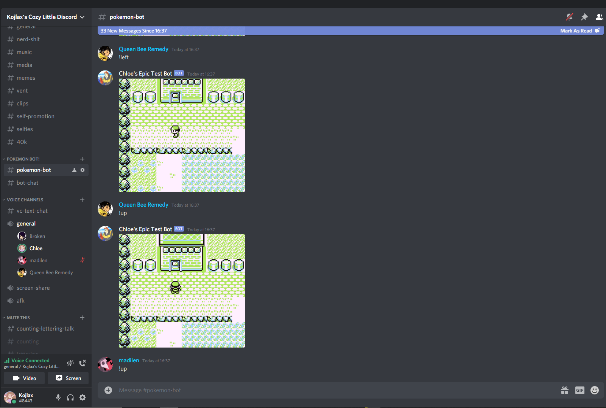

# Pokemon Discord Bot
This is my first project I've worked seriously on: A game of pokemon you can play in your discord server!

Now, let me get this out of the way: this code is a hacky piece of garbage and I don't recommend anyone use it. It was made as a proof of concept to be used by me and only me for exactly a week before I turned it off forever. However, if you really want to run this on your own server, or to modify it yourself, here's the rundown on how it works:

## The emulator
You're going to need to download your own emulator and rom, but personally, I recommend [BGB](http://bgb.bircd.org). It's lightweight, very fast, lets you change the speed to whatever you want, has a built in screenshot tool, and, allows you to turn off video output, as it's unnecessary for this, which makes it even faster.

And most importantly, it accepts input from the F13-F21 keys. Although it isn't necessarily *required* to use those keys, them being pressed won't mess up any other programs you're using, and you won't ever accidentally press them, so that's what I use in the code.

In terms of configuring the emulator, it also should be set to about 10-20x speed. This isn't required, but makes any actions virtually instant, vastly speeding up bot speed

## Dependancies
This bot uses DSharpPlus.Common and DSharpPlus.CommandsNext, which both need to be installed via NuGet

## The Code Rundown
Okay, so here's the rundown on how the code actually works:
The bot listens for a command that corresponds to a gameboy button (right, left, up, down, a, b, select, start). It then presses a key corresponded to that button (F13-F20, corresponding to the above keys in order). It then waits an amount of time specified ahead of time by you, based on the speed your emulator is running at, before hitting the F21 key, which, if your emulator is configured properly, should take a screenshot. The bot then takes that image, resizes it to 800x720 so its easier to see, and responds to the initial message with that new image

## Final thoughts
This code is a fucking mess, it was my first real project, and to be honest, I'm happy with this. Even if it is kinda hacky and could have been made better, it did what I wanted it to, and really, that's good enough for me. Also, as a final point, if you do wanna run this bot, or a variant of it, you should probably write a script that clears out your emulator's screenshot folder every now and then. The images are absolutely tiny, but they do add up, especially if many people are using it at once, but it probably won't ever reach more than a gig a day.